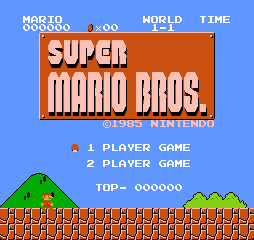
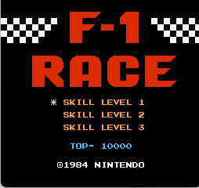
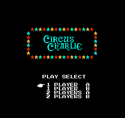
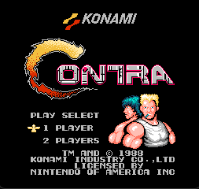
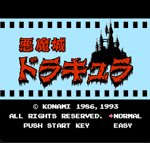
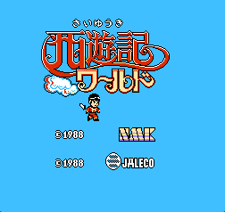
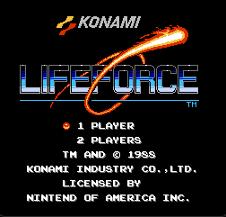
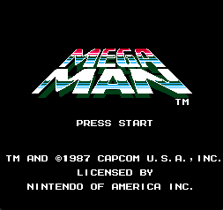
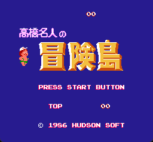
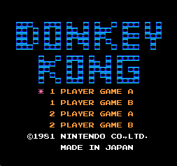

**English** | [中文](./README_zh.md) 


# nes simulator 

[](http://makeapullrequest.com)[](http://www.firsttimersonly.com/)

[](https://github.com/Dozingfiretruck/nes/releases/latest)


github: [Dozingfiretruck/nes: A NES emulator in C (github.com)](https://github.com/Dozingfiretruck/nes) (recommend)

gitee: [nes: c语言实现的nes模拟器 (gitee.com)](https://gitee.com/Dozingfiretruck/nes) (updates may not be timely due to synchronization issues)

## Introduction
​	The nes simulator implemented in C , requires `C11` or above

​	**attention：This repository is only for the nes simulator and does not provide the game ！！！**


**Platform support:**

- [x] Windows

- [x] Linux

- [x] MacOS

**Simulator support：**

- [x] CPU

- [x] PPU

- [x] APU

**mapper  support：**

​	0, 2, 3, 7, 94, 117, 180

## Software Architecture
​	The example is based on SDL for image and sound output, without special dependencies, and you can port to any hardware by yourself


## Compile Tutorial

​	clone repository，install [xmake](https://github.com/xmake-io/xmake)，execute `xmake` directly to compile

### Compile Preparation

#### Windows:	

​	install MSVC([Visual Studio 2022](https://visualstudio.microsoft.com/zh-hans/vs/))

​	install [xmake](https://github.com/xmake-io/xmake)

#### Linux(Ubuntu):

```shell
sudo add-apt-repository ppa:xmake-io/xmake -y
sudo apt-get update -y
sudo apt-get install -y git make gcc p7zip-full libsdl2-dev xmake
```

#### Macox:

```shell
ruby -e "$(curl -fsSL https://raw.githubusercontent.com/Homebrew/install/master/install)"
brew update
brew install make gcc sdl2 xmake
```

### Compilation Method

​	clone repository，execute `xmake` directly to compile

## Instructions

​	on linux or macos enter  `./nes xxx.nes` load the game to run

​	on windows enter `.\nes.exe xxx.nes` load the game to run

## Key mapping

| joystick |  up  | down | left | right | select | start |  A   |  B   |
| :------: | :--: | :--: | :--: | :---: | :----: | :---: | :--: | :--: |
|    P1    | `W`  | `S`  | `A`  |  `D`  |  `V`   |  `B`  | `J`  | `K`  |
|    P2    | `↑`  | `↓`  | `←`  |  `→`  |  `1`   |  `2`  | `5`  | `6`  |

**Note: P2 uses numberic keypad**

## Transplant instructions

​	The source code in the `inc`and `src` directories does not need to be modified, only the three files in the `port` directory `nes_conf.h` `nes_port.c` `nes_port.h`

- `nes_conf.h` is a configuration file, configure according to your needs, such as printing extra definitions, the implementation of `nes_log_printf`
- `nes_port.c` is the main porting file, which needs to be ported according to the needs


​	**Note: If the target platform for migration has weak performance and small space, some macro configurations are specially reserved:**

- `NES_ENABLE_SOUND` can be set to 0 to turn off the APU to increase the running speed
- `NES_RAM_LACK` can be set to 1, using a half-screen refresh to reduce RAM consumption (running at a slower speed)
- You can configure `NES_FRAME_SKIP` to skip frames
- If SPI 8-byte transmission is used for embedded platforms, the color anomaly configuration `NES_COLOR_SWAP` can be used to switch the large and small ends


​	**In addition, the APU synthesis uses single floating-point calculations, and the code can optimize the single-floating-point calculation acceleration or not use single-floating-point calculations to speed up the operation in `nes_apu.c`**

## Showcase

**mapper 0:**

|  |  | .png) | .png) |
| :--------------------------------------------: | :----------------------------: | :------------------------------------------: | ------------------------------- |
|     |                                |                                              |                                 |

**mapper 2:**


|    |  |  |  |
| :------------------------------: | :------------------------------------: | :----------------------------: | ---------------------------------- |
|  |  .png)   |                                |                                    |

**mapper 3:**

|  |  |
| :------------------------------: | :------------------------------------: |


**mapper 94:**

.png)

**mapper 180:**

.png)

## Literature reference

https://www.nesdev.org/


