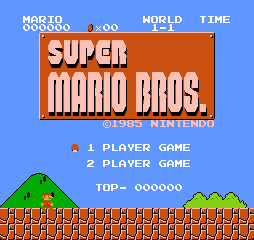

[**English**](./README.md)  | **中文**

# nes

#### 介绍
c语言实现的nes模拟器，要求c11

**注意：**

**本仓库仅为nes模拟器，不提供游戏本体！！！**

平台支持:

- [x] Windows

- [x] Linux

- [x] MacOS

模拟器支持情况：

- [x] CPU

- [x] PPU

- [x] APU

mapper 支持：0, 2, 3

#### 软件架构
示例基于SDL2进行图像声音输出，没有特殊依赖，您可自行移植至任意硬件

#### 编译教程

​	克隆本仓库，安装 [xmake](https://github.com/xmake-io/xmake)，直接执行 xmake 编译即可 

#### 使用说明

​	linux或macos下输入 `./nes xxx.nes` 加载要运行的游戏

​	windows下输入 `.\nes.exe xxx.nes` 加载要运行的游戏

#### 按键映射

| 手柄 |  上  |  下  |  左  |  左  | 选择 | 开始 |  A   |  B   |
| :--: | :--: | :--: | :--: | :--: | :--: | :--: | :--: | :--: |
|  P1  |  W   |  S   |  A   |  D   |  V   |  B   |  J   |  K   |
|  P2  |  ↑   |  ↓   |  ←   |  →   |  1   |  2   |  5   |  6   |

#### 运行展示

mapper 0:

|   游戏名   |                  演示                  |
| :--------: | :------------------------------------: |
| 超级马里奥 |  |
|   F1赛车   |          |

mapper 2:

| 游戏名  |               演示                |
| :-----: | :-------------------------------: |
| 魂斗罗1 |  |
| 恶魔城1 |  |
| 西游记1 |      |
| 洛克人 |  |
| 沙罗曼蛇 |  |

mapper 3:

|      游戏名      |                  演示                  |
| :--------------: | :------------------------------------: |
| 高桥名人的冒险岛 |    |
|      大金刚      |  |

#### 文献参考

https://www.nesdev.org/

