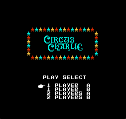
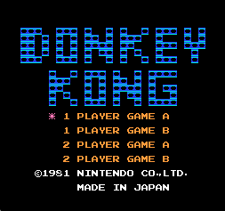

[**English**](./README.md)  | **中文**


# nes 模拟器

[](http://makeapullrequest.com)[](http://www.firsttimersonly.com/)

[](https://github.com/Dozingfiretruck/nes/releases/latest)


github: [Dozingfiretruck/nes: A NES emulator in C (github.com)](https://github.com/Dozingfiretruck/nes) (推荐)

gitee: [nes: c语言实现的nes模拟器 (gitee.com)](https://gitee.com/Dozingfiretruck/nes) (由于同步问题可能导致更新不及时)

## 介绍
​	C语言实现的nes模拟器，要求C语言标准: **C11** 以上

​	**注意：本仓库仅为nes模拟器，不提供游戏本体！！！**


**平台支持:**

- [x] Windows

- [x] Linux

- [x] MacOS

**模拟器支持情况：**

- [x] CPU

- [x] PPU

- [x] APU

**mapper 支持：**

​	0, 2, 3, 7, 94, 117, 180

## 软件架构
​	示例基于SDL进行图像声音输出，没有特殊依赖，您可自行移植至任意硬件


## 编译教程

### 编译准备

#### Windows:	

​	安装MSVC([Visual Studio 2022](https://visualstudio.microsoft.com/zh-hans/vs/))

​	安装 [xmake](https://github.com/xmake-io/xmake)

#### Linux(Ubuntu):

```shell
sudo add-apt-repository ppa:xmake-io/xmake -y
sudo apt-get update -y
sudo apt-get install -y git make gcc p7zip-full libsdl2-dev xmake
```

#### Macox:

```shell
ruby -e "$(curl -fsSL https://raw.githubusercontent.com/Homebrew/install/master/install)"
brew update
brew install make gcc sdl2 xmake
```

### 编译方法

​	克隆本仓库，直接执行 `xmake` 编译即可 

## 使用说明

​	Linux或Macos下输入 `./nes xxx.nes` 加载要运行的游戏

​	Windows下输入 `.\nes.exe xxx.nes` 加载要运行的游戏

## 按键映射

| 手柄 |  上  |  下  |  左  |  左  | 选择 | 开始 |  A   |  B   |
| :--: | :--: | :--: | :--: | :--: | :--: | :--: | :--: | :--: |
|  P1  | `W`  | `S`  | `A`  | `D`  | `V`  | `B`  | `J`  | `K`  |
|  P2  | `↑`  | `↓`  | `←`  | `→`  | `1`  | `2`  | `5`  | `6`  |

**注意：P2使用数字键盘(小键盘)**

## 移植说明

​	`inc` 和 `src` 目录下的源码无需修改，只需要修改`port`目录下的三个文件 `nes_conf.h` `nes_port.c` `nes_port.h`

- `nes_conf.h`为配置文件，根据自己需求配置即可,如需打印额外定义 nes_log_printf 的实现
- `nes_port.c`为主要移植文件，需要根据需求进行移植


​	**注意:如果移植的目标平台性能羸弱、空间较小等特别预留了一些宏配置：**

- 可以将`NES_ENABLE_SOUND`设置为0关闭apu以增加运行速度
- 可以将`NES_RAM_LACK`设置为1使用半屏刷新以减少ram消耗(运行速度会降低)
- 可以自行配置`NES_FRAME_SKIP`进行跳帧
- 如果为嵌入式平台使用spi 8字节传输时颜色异常配置`NES_COLOR_SWAP`可进行大小端切换


​	**另外，APU合成使用了单浮点数计算，代码在nes_apu.c中，可自行优化单浮点计算加速或者不使用单浮点计算以加速运行速度**

## 运行展示

**mapper 0:**

|  |  | .png) | .png) |
| :--------------------------------------------: | :----------------------------: | :------------------------------------------: | ------------------------------- |
|     |                                |                                              |                                 |

**mapper 2:**


|    |  |  |  |
| :------------------------------: | :------------------------------------: | :----------------------------: | ---------------------------------- |
|  |  .png)   |                                |                                    |

**mapper 3:**

|  |  |
| :------------------------------: | :------------------------------------: |


**mapper 94:**

.png)

**mapper 180:**

.png)

## 文献参考

https://www.nesdev.org/


