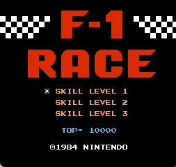
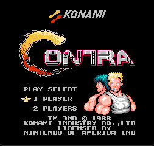
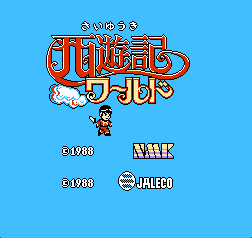
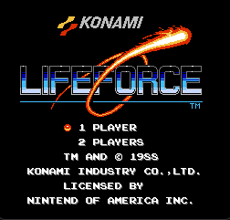

[**English**](./README.md)  | **中文**

# nes

## 介绍
c语言实现的nes模拟器，要求c11

**注意：**

**本仓库仅为nes模拟器，不提供游戏本体！！！**

平台支持:

- [x] Windows

- [x] Linux

- [x] MacOS

模拟器支持情况：

- [x] CPU

- [x] PPU

- [x] APU

mapper 支持：0, 2, 3, 7, 94, 117, 108

## 软件架构
示例基于SDL2进行图像声音输出，没有特殊依赖，您可自行移植至任意硬件

## 编译教程

​	克隆本仓库，安装 [xmake](https://github.com/xmake-io/xmake)，直接执行 xmake 编译即可 

## 使用说明

​	linux或macos下输入 `./nes xxx.nes` 加载要运行的游戏

​	windows下输入 `.\nes.exe xxx.nes` 加载要运行的游戏

## 按键映射

| 手柄 |  上  |  下  |  左  |  左  | 选择 | 开始 |  A   |  B   |
| :--: | :--: | :--: | :--: | :--: | :--: | :--: | :--: | :--: |
|  P1  |  W   |  S   |  A   |  D   |  V   |  B   |  J   |  K   |
|  P2  |  ↑   |  ↓   |  ←   |  →   |  1   |  2   |  5   |  6   |

## 运行展示

**mapper 0:**

|  |  | .png) | .png) |
| :--------------------------------------------: | :----------------------------: | :------------------------------------------: | ------------------------------- |
|     |                                |                                              |                                 |

**mapper 2:**

|    |  |  |  |
| :------------------------------: | :------------------------------------: | :----------------------------: | ---------------------------------- |
|  |  .png)   |                                |                                    |

**mapper 3:**

|  |  |
| :------------------------------: | :------------------------------------: |

**mapper 94:**

.png)

**mapper 180:**

.png)

## 文献参考

https://www.nesdev.org/

